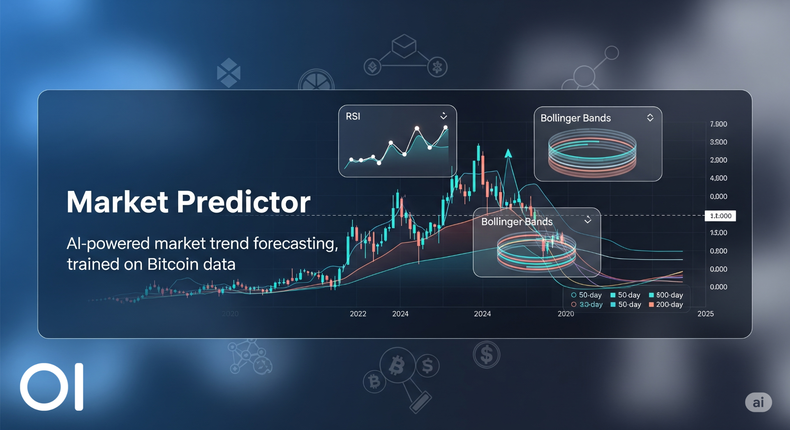
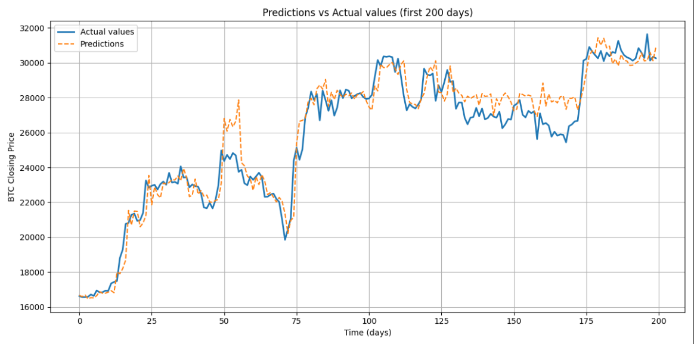

# 📈 Market Predictor

Market Predictor is a machine learning project for **forecasting general market trends**, currently trained on **Bitcoin's daily closing price**, using **engineered features**, **technical indicators**, and the **XGBoost** model.

The model is trained on Bitcoin historical data from 2012 onward, originally at 1-minute resolution and then aggregated into **daily candles** for more stable and meaningful forecasting. This serves as a proof of concept for applying the same methodology to other assets and markets.

---

## 📊 Prediction Example



---

## 🚀 Main Features
 
- 🕰️ Daily timeframe (`1D`) for stable signal extraction  
- 📊 Technical indicators: RSI, ATR, Bollinger Bands, SMA(20/50/200), and more  
- 🧠 XGBoost regression model  
- 📦 Full pipeline: preprocessing, feature engineering, training, evaluation  
- 📈 Visual comparison between predictions and real values  

---

## 📁 Project Structure

```
market-predictor/
├── data/
│   ├── raw/
│   │   └── btcusd_1-min_data.csv          ← raw data
│   └── processed/
│       ├── btcusd_clean_daily.csv         ← aggregated to daily
│       ├── btcusd_features_daily.csv      ← basic features
│       └── btcusd_final_dataset_daily.csv ← final dataset with lags
├── outputs/
│   └── predictions_vs_real.png            ← final plot
├── src/
│   ├── data_loader.py                     ← load and aggregate data
│   ├── preprocessing.py                   ← clean data + tech indicators
│   ├── future_generator.py                ← lagged feature generation
│   └── price_model_xgb.py                 ← XGBoost regression model
├── tests/
│   └── test_preprocessing.py              ← unit tests (optional)
├── main.py                                ← pipeline runner
├── pyproject.toml                         ← Poetry config
└── README.md
```

---

## 🧠 Tech Stack

- Python 3.11
- [Poetry](https://python-poetry.org/)
- XGBoost
- Pandas, NumPy
- Matplotlib
- TA-Lib (optional)
- scikit-learn (metrics, split)

---

## 📈 Technical Indicators

- ✅ RSI (14)
- ✅ Bollinger Bands (20)
- ✅ ATR (14)
- ✅ SMA (20, 50, 200)
- ✅ Momentum (10)
- ✅ Z-Score (30)
- ✅ Volume change %
- ✅ Candlestick body & direction (bullish/bearish)
- ✅ Volatility & return %
- ✅ Lag features from past N days

---

## ⚙️ Setup

### 1. Clone the repository

```bash
git clone https://github.com/your-username/market-predictor.git
cd market-predictor
```

### 2. Install dependencies using Poetry

```bash
poetry install
```

### 3. Run the pipeline

```bash
poetry run python main.py
```

You will get:
- 📉 Model evaluation (MSE, R², MAE)
- 📈 Plot saved at `outputs/predictions_vs_real.png`

---

## 📊 Console Output Example

```
✅ Aggregated to daily candles: 4966 rows
✅ Basic features and target created
✅ Final dataset ready for training
✅ XGBoost Evaluation: MSE = 418641509.3173, R² = 0.5170
📏 MAE: 11977.7100
📊 R²: 0.5170
```

---

## 🧪 Evaluation Metrics

- **MSE**: Mean Squared Error
- **MAE**: Mean Absolute Error
- **R² (R-squared)**: Coefficient of determination  
  > Values above 0.5 suggest good fit and potential predictive power

---

## 🛣️ Roadmap

- [ ] Hyperparameter tuning with Optuna
- [ ] Add macroeconomic signals
- [ ] News-based sentiment analysis
- [ ] Interactive dashboard (Plotly/Streamlit)
- [ ] Multi-asset support (ETH, SOL, etc.)

---

## 🤝 Contributing

Pull requests are welcome!  
For major changes, please open an issue first.

---

## 📄 License

This project is open-source, created for educational and research purposes.  
Distributed under the MIT license.
